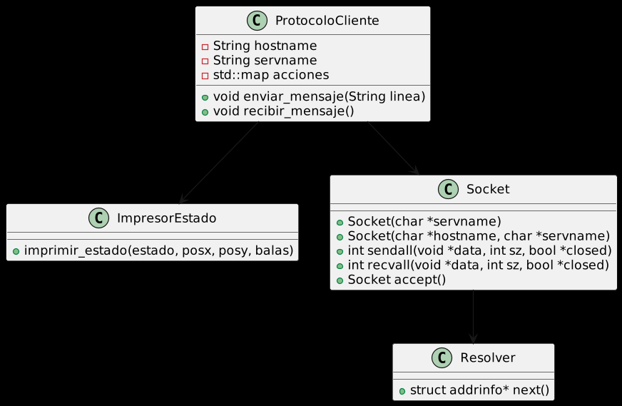

# Taller de Programacion - TP Sockets 

Enunciado: [Enunciado_Sockets.pdf](https://github.com/Taller-de-Programacion-TPs/sockets-2023c1-Fanusaez/files/11236045/Enunciado_Sockets.pdf)

## Compilacion

Desde el root del proyecto

`make`

Esto generara los ejecutables
## Ejecucion

* Para ejecutar el servidor `./server <puerto>  <tamaño_mapa_x> <tamaño_mapa_y>`
* Para ejecutar el cliente `./client  localhost <puerto>  <ruta_archivo>`

## Modelo 
Para el trabajo se requería implementar una comunicación entre cliente - servidor
en donde los mismos se comunican a través de sockets.

El trabajo se dividió en dos partes:

### Cliente
Esta parte es donde se lee de un archivo las acciones que el jugador realiza y a través de la clase
ProtocoloCliente podemos comunicar esta acción con el protocolo acordado para enviarlo al servidor.

Al momento de recibir un mensaje, se recibe el estado del juego, dicho estado lo imprimimos a través de la clase ImpresorEstado
En donde se interpreta el mensaje y se lo procesa para ser impreso.

_Imagen 1 -> Clases del modelo cliente_

### Servidor
Se encarga de recibir las acciones provenientes del cliente y asegurarse de que sean 
informadas a la clase Soldado para que dichas acciones sean efectuadas.
Una vez que la acción correspondiente se realiza, el soldado a través de la clase 
ImpresorEstado, debe imprimir el estado de juego.

También se encarga de enviar al cliente el estado actual en que se encuentra el juego.

_Imagen 2 ->  Clases del modelo servidor_

## Diagramas de secuencia

### Cliente

_Imagen 3 ->  Diagrama de secuencia cliente envia mensaje_

_Imagen 4 ->  Diagrama de secuencia cliente recibe mensaje_

### Servidor

_Imagen 5 ->  Diagrama de secuencia servidor inicia comunicacion_

# ProtocoloCliente
Para facilitar la comunicación con el servidor se creó la clase ProtocoloCliente, que se encarga de recibir un string desde el main
separarlo en tokens y con un diccionario serializar el mensaje en un buffer para mandarlo por el socket al servidor.

Al momento de recibir mensajes, se hace la conversión al endianness del host, para posteriormente interpretar los bytes recibidos
y enviarlos a la clase ImpresorEstado para que imprima el mensaje correctamente por pantalla.

# ProtocoloServer
Para facilitar la comunicación con el cliente se creó la clase ProtocoloServer, se encarga de recibir los bytes proveniente del cliente
que representa una acción a ejecutar, dicha acción es enviada a la clase Soldado que se encarga de interpretarla para realizar la acción correspondiente

Para enviar el estado del juego, se le pide a Soldado el estado actual del juego y la clase se encarga de alojarla en un buffer y convertirla al endianness de la red. Finalmente se envía el buffer que contiene 7 bytes.

# Soldado
Soldado lleva a cabo las acciones que se reciben del cliente y cambia el estado del juego en base a ello.

